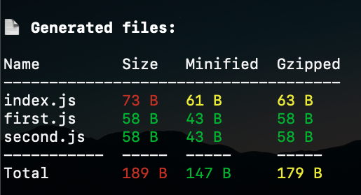

# rollup-plugin-summary
A rollup plugin that summarizes the output of the build. Under the hood, it uses [rollup-plugin-filesize](https://www.npmjs.com/package/rollup-plugin-filesize) to calculate file sizes and display them in a tabular form using [as-table](https://www.npmjs.com/package/as-table) and color it with [chalk](https://www.npmjs.com/package/chalk).



## Installation

<hr/>

### npm

```terminal
npm i rollup-plugin-summary -D
```

### yarn

```terminal
yarn add rollup-plugin-summary -D
```

<hr/>

## Usage

File: *`rollup.config.js`*

```javascript
import summary from 'rollup-plugin-summary';

export default {
    plugins: [
        summary(),
    ]
}
```

<hr/>

## Options

| Name      | Type   | Description                                             | Default |
|-----------|--------|---------------------------------------------------------|---------|
| warnLow   | number | Minimum size in bytes to be highlighted in yellow       | 5000    |
| warnHigh  | number | Minimum size in bytes to be highlighted in red          | 10000   |
| totalLow  | number | Minimum total size in bytes to be highlighted in yellow | 200000  |
| totalHigh | number | Minimum total size in bytes to be highlighted in red    | 300000  |

<hr/>

## License

MIT
