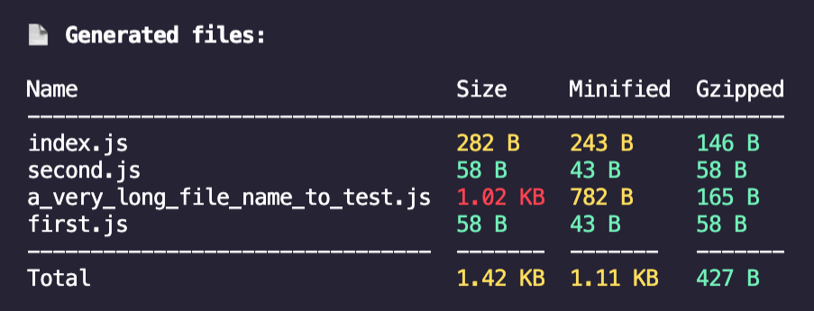

[](https://www.npmjs.com/package/rollup-plugin-summary)
[](http://commitizen.github.io/cz-cli/)
[](https://github.com/semantic-release/semantic-release)


[](https://codecov.io/gh/yousifalraheem/rollup-plugin-summary)
[](https://github.com/yousifalraheem/rollup-plugin-summary/actions/workflows/release.yml)

# rollup-plugin-summary

A rollup plugin that summarizes the output of the build.



## Installation

<hr/>

### npm

```terminal
npm i -D rollup-plugin-summary
```

### yarn

```terminal
yarn add -D rollup-plugin-summary
```

<hr/>

## Usage

File: _`rollup.config.js`_

```javascript
import summary from "rollup-plugin-summary";

export default {
  plugins: [summary()],
};
```

<!-- github-only-start -->

<hr/>

## Documentation

Read the full [documentation](https://yousifalraheem.github.io/rollup-plugin-summary/) to learn about options and more.

<hr/>

## License

MIT

<!-- github-only-end -->
