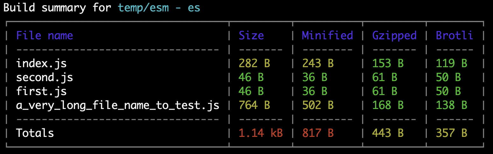

[](https://www.npmjs.com/package/rollup-plugin-summary)
[](http://commitizen.github.io/cz-cli/)
[](https://github.com/semantic-release/semantic-release)


[](https://codecov.io/gh/yousifalraheem/rollup-plugin-summary)
[](https://github.com/yousifalraheem/rollup-plugin-summary/actions/workflows/release.yml)

# rollup-plugin-summary

A rollup plugin that summarizes the output of the build.



## Installation

<hr/>

### npm

```terminal
npm i -D rollup-plugin-summary
```

### yarn

```terminal
yarn add -D rollup-plugin-summary
```

### pnpm

```terminal
pnpm add -D rollup-plugin-summary
```

<hr/>

## Usage

File: _`rollup.config.js`_

```javascript
import summary from "rollup-plugin-summary";

export default {
  plugins: [summary()],
};
```


<hr/>

## Options

These are the available options:

| Name              | Type      | Description                                                                                                                                                                                                                          | Default  |
| ----------------- | --------- | ------------------------------------------------------------------------------------------------------------------------------------------------------------------------------------------------------------------------------------ | -------- |
| warnLow?          | `number`  | Minimum size in bytes to be highlighted in yellow.<br><sub>This is used to warn <span style="color: #ffcd39;">(in yellow)</span> about the files whom on the brink of exceeding the acceptable pre-defined file size</sub>           | `5000`   |
| warnHigh?         | `number`  | Minimum size in bytes to be highlighted in red.<br><sub>This is used to alert <span style="color: #dc3545;">(in red)</span> about files that exceeded the acceptable pre-defined file size</sub>                                     | `10000`  |
| totalLow?         | `number`  | Minimum total size in bytes to be highlighted in yellow.<br><sub>This is used to warn <span style="color: #ffcd39;">(in yellow)</span> about the total build size if it comes nearly below maximum acceptable pre-defined size</sub> | `200000` |
| totalHigh?        | `number`  | Minimum total size in bytes to be highlighted in red.<br><sub>This is used to alert <span style="color: #dc3545;">(in red)</span> about the total build size if it exceeds the acceptable pre-defined size</sub>                     | `300000` |
| showBrotliSize?   | `boolean` | Should calculate and show Brotli size                                                                                                                                                                                                | `false`  |
| showMinifiedSize? | `boolean` | Should calculate and show Minified size                                                                                                                                                                                              | `false`  |
| showGzippedSize?  | `boolean` | Should calculate and show Gipped size                                                                                                                                                                                                | `false`  |

<br/>

Here is an example of how it's used:

```javascript
{
  plugins: [
    summary({
      warnLow: 1000,
      warnHigh: 3000,
      showMinifiedSize: false,
    }),
  ];
}
```

<br/>

<small>**Note:** File sizes will be evaluated against **high** values first. For example, if you've set `warnLow`
and `warnHigh` to the same value, the files exceeding that number will be highlighted in red since the `warnHigh` is
prioritized. Same goes for `totalLow` and `totalHigh`</small>

<hr/>

## License

MIT